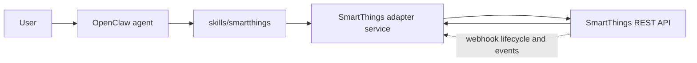

# SmartThings architecture

Last updated: 2026-03-16

## Goal

Build a **skill-first** Samsung SmartThings integration for OpenClaw that keeps
all SmartThings-specific auth, device discovery, command dispatch, webhook
handling, and TV state normalization in a separate adapter service.

Compatibility target:

- Milestone behavior should fit a **March 13, 2025** style deployment baseline.
- Local development should work with a **SmartThings personal access token
  (PAT)** and direct REST polling.
- Production should move to an **OAuth-In SmartApp** model for install,
  lifecycle, token refresh, and webhook-backed subscriptions.

## Why skill-first for milestone 1

- OpenClaw already supports workspace skills and user-invocable skill slash
  commands.
- The integration is optional and vendor-specific, so it should not become a
  new core tool before the adapter contract stabilizes.
- The skill can stay thin: it just calls the adapter over HTTP and presents
  normalized results back to the agent.
- The adapter can evolve independently for SmartThings auth and webhook changes
  without forcing OpenClaw core changes.

## High level design

### Components

- **OpenClaw skill**
  - Lives in `skills/smartthings`.
  - Exposes the operator-facing commands `list_devices`, `get_tv_state`, and
    `send_command`.
  - Calls the adapter over HTTP through small helper scripts.
- **SmartThings adapter**
  - Lives outside OpenClaw core under `adapter/`.
  - Owns SmartThings credentials and SmartThings-specific protocol logic.
  - Exposes a narrow HTTP contract for the skill and future automation callers.
- **SmartThings cloud**
  - Remains the system of record for device inventory, status, commands, and
    SmartApp lifecycle callbacks.

## Adapter boundary

The adapter owns these responsibilities:

- Translate SmartThings REST responses into stable adapter DTOs.
- Normalize Samsung TV power state into `offline`, `standby`, `on`, or
  `unknown`.
- Keep raw SmartThings payloads available for troubleshooting.
- Hide auth differences between PAT polling and OAuth-In SmartApp operation.
- Receive SmartThings webhook lifecycle events.

The adapter does **not** own these responsibilities in milestone 1:

- Direct OpenClaw core plugin registration
- New OpenClaw MCP surfaces
- Persistent event fanout back into OpenClaw sessions
- Long-term subscription repair orchestration across multiple locations

## HTTP surface

The adapter should expose at minimum:

- `GET /health`
- `GET /devices`
- `GET /devices/:id/status`
- `POST /devices/:id/commands`
- `POST /subscriptions/bootstrap`
- `POST /webhooks/smartthings`

The skill should use only those routes. That keeps the contract narrow and
allows future migration from local PAT polling to OAuth-backed production
without changing the skill interface.

## Request flows

### Skill-driven read path

1. A user asks OpenClaw to list devices or inspect a Samsung TV.
2. The SmartThings skill helper script calls the adapter over HTTP.
3. The adapter fetches SmartThings device inventory or status.
4. The adapter normalizes the TV state and returns both normalized and raw
   evidence.
5. The skill returns a concise result to OpenClaw.

### Skill-driven command path

1. A user asks OpenClaw to send a device command.
2. The skill helper script calls `POST /devices/:id/commands`.
3. The adapter forwards the SmartThings command payload.
4. The adapter optionally re-reads device status and returns the normalized
   result plus command acceptance metadata.

### Webhook path

1. SmartThings posts lifecycle or event payloads to
   `POST /webhooks/smartthings`.
2. The adapter validates the lifecycle shape, handles confirmation, and updates
   local state as needed.
3. Milestone 1 keeps webhook handling local to the adapter.
4. TODO: production can later push event summaries into OpenClaw through a
   plugin, hook, or queue once the event model is stable.

## Deployment modes

| Mode             | Auth                  | Primary use                       | Status source            | Subscriptions   |
| ---------------- | --------------------- | --------------------------------- | ------------------------ | --------------- |
| `pat-dev`        | Personal access token | Local development, manual testing | Live REST polling        | Not first-class |
| `oauth-smartapp` | OAuth-In SmartApp     | Production                        | REST + webhook lifecycle | Required        |

### PAT development mode

Use this mode first because it has the lowest setup cost.

- Supply a PAT to the adapter.
- If you set `SMARTTHINGS_PUBLIC_URL`, treat it as the **full public webhook
  callback URL**, not just a host or origin.
- Poll `GET /devices` and `GET /devices/:id/status` on demand.
- Allow `POST /devices/:id/commands` for targeted manual control.
- Treat `POST /subscriptions/bootstrap` as a no-op or capability probe in this
  mode.
- TODO: if SmartThings later allows a clean PAT-only subscription flow that
  fits the production model, revisit this assumption.

### OAuth-In SmartApp production mode

Use this mode for real deployments.

- Install the SmartApp and complete OAuth.
- Store access token, refresh token, installed app ID, and location context in
  the adapter.
- Use `POST /subscriptions/bootstrap` to create or repair SmartThings
  subscriptions against the adapter webhook URL.
- Accept SmartThings lifecycle callbacks at `POST /webhooks/smartthings`.
- Refresh tokens inside the adapter, not inside OpenClaw skill scripts.

## Migration path

The migration path should preserve the skill contract while swapping the auth
mode behind the adapter.

### Phase 1

- Run the adapter locally with a PAT.
- Validate device discovery, TV normalization, and power commands.
- Keep the skill pinned to adapter endpoints only.

### Phase 2

- Introduce OAuth-In SmartApp credentials and installed app state to the
  adapter.
- Keep existing skill commands unchanged.
- Add subscription bootstrap and webhook confirmation flows.

### Phase 3

- Move production deployments to `oauth-smartapp`.
- Keep `pat-dev` as a fallback for local repro and fixture capture.
- Use webhook-triggered cache updates to reduce repeated polling.

### Phase 4

- Optionally add richer OpenClaw integration only after the adapter contract is
  stable.
- Candidates: event summaries, device aliasing, home/room grouping, and command
  safety prompts.

## Data model decisions

- The skill should treat the adapter as the only SmartThings-facing API.
- The adapter should expose both:
  - a normalized TV state for automation safety
  - the relevant raw SmartThings payload fragment for debugging
- Device IDs, capability names, and component names should pass through without
  OpenClaw-specific rewriting.

## Non-goals for milestone 1

- Rich TV media transport control beyond documented command passthrough
- SmartThings app installation UX inside OpenClaw
- Multi-home orchestration in OpenClaw core
- Event-triggered autonomous actions directly from webhook input

## Deferred production work

- TODO: validate SmartThings webhook authenticity and replay protection.
- TODO: persist OAuth tokens and installed app metadata in a real secret store.
- TODO: implement subscription repair and token refresh retry policies.
- TODO: define how webhook-driven state changes should surface back into
  OpenClaw sessions without spamming channels.
